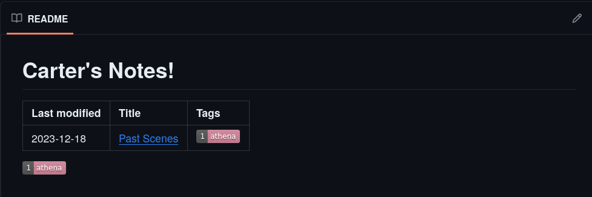
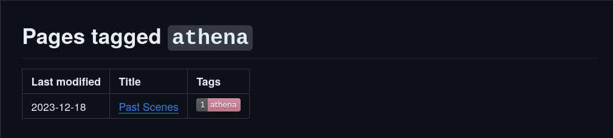

# Workbench

This is a simple brainstorming space powered by the GitHub frontend, a GitHub action, and a Python script. Thank you to [David Marx](https://github.com/dmarx) for coming up with the idea for this and writing the original script, which I have tweaked to work for me!

My personal notes are kept on a different branch of the same local repo that this GitHub repo is the remote for, and I use a private GitHub repo as the remote for that branch. [This](https://stackoverflow.com/a/62213595) is the guide I followed to set that up! For viewing and editing my notes I use vscodium on my laptop, and markor on my phone (with the git repo setup using [termux](https://f-droid.org/packages/com.termux/) & managed using scripts through [termux-widgets](https://f-droid.org/en/packages/com.termux.widget/)).

# Setup

1. Click on the "Use this template" button in the top-right to create a new repo based on this one
2. In your repo's settings, give GitHub Actions write permissions
3. Change the name of `README.stub.template` to `README.stub`, and change its heading to your liking
4. Edit scripts/tag_color_dict.py to set badge colors for specific tags and a default for tags you don't specify

# Usage

1. Add markdown files to the repo's root folder. Files in subfolders are not included in the README table of contents, so I use them to archive notes and hold my todo.txt)
2. Upon committing, a GitHub Action runs that will build the README and tag pages (markdown files that group notes by tag)

The README will contain a table of contents for your notes, which will include a row for each note with:

* A link to the note with the title from its YAML frontmatter as anchor text
* Badges for each tag in the YAML frontmatter, which are links to their respective tag pages
* The note's modification date, used to sort the table of contents

The bottom of the README will have badges for all of the tags present in your notes, ordered by how often they appear.

The table of contents will look something like this:

And tag pages will look something like this:

## Rules to keep stuff from breaking

1. Make sure note filenames contain no whitespace and use the `.md` suffix
2. Define each note's title and tags with YAML frontmatter fields called "title" and "tags". Multiple tags must be comma separated 
